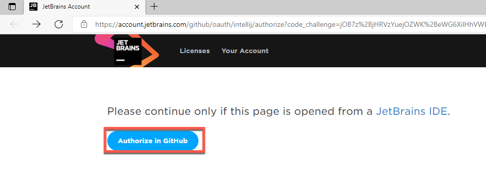

# Version Control and Projects  

## Overview
   
##### This instruction set shows you how to:
- Add Version Control to a project through IntelliJ   
- Share a Java Project to your GitHub    
   
This instruction set works with the project created in [Creating a New Project](https://github.com/daquioag/team-SAL/blob/gh-pages/docs/configuration.md)
 or any other local project from IntelliJ.    

##### Why should we use implement version control to our projects?      
Adding version control helps keep track of changes by allowing contributors to push code with commit messages describing the changes. Version control also allows for reviewing previous changes and old code blocks. The ability to review old code acts as a safety net in the case of future changes that may break the program, so having version control allows contributors to go back and change back the program to a point where it was functional. 

### Notes:   
<code>⚠️ ATTENTION: </code> This instruction set was created using the *Ultimate* Version of the IntelliJ IDEA on a Windows 10 machine.    

Before starting this instruction set:   
You will need a GitHub account in order to connect your IntelliJ project to version control.
Create a [GitHub account](https://github.com/join) if you do not already have one.   
You will need a JetBrains account in order to use the Ultimate* Version of the IntelliJ IDEA.
Create a [JetBrains account](https://account.jetbrains.com/login) if you do not already have one. 

---

## Adding Version Control to a project through IntelliJ
  

1. Press <code>⊞ Win</code> and type IntelliJ into the search bar, click the IntelliJ icon to open the application.  
 On Mac, press <code>cmd</code> + <code>space</code> and type in IntelliJ, press enter to open the application.
   
   A window called *Welcome to IntelliJ IDEA*  will appear.
   
2. Click on the  Project File that you want to add version control to. For this instruction set, we are going to use the *VersionControlDemo* project seen in the image below.   
      You will be brought to the **Main IntelliJ Window**.    

   
   
3. Navigate to the **VSC** tab in the top menu bar.
   
   
   
   Click on **Share Project on GitHub**. 
   
   

   A pop-up window called *Share Project On GitHub*  will appear.

   <code>⚠️ ATTENTION: </code> For this instruction set, we have made our project to be 'private'. **See top left corner of the *Share Project On GitHub* window.**       Not checking this check box will make your project 'public'. Making a GitHub project repository 'public' allows for anyone have access to it. Anyone would be copy and use the files in the project repository.    
   >   

4. Click on **Add Account** in the *Share Project On GitHub* window.   

  A drop-down menu will appear, showing the options of *Log in via GitHub...* or *Log in with token...*.   
   <code>⚠️ ATTENTION:  </code>  For this instruction set we are going to add out GitHub account using the *Log in via GitHub...* option.

5.  Click on **Log in via GitHub...**    
   >

   Aftering clicking on **Log in via GitHub...**, you will be redirected to the following JetBrains web browser.
      >   

   Click **Authorize in GitHub** and it will ask you to log into GitHub.
   Add in your GitHub log-in information and click on **Sign in**.    
6.  Log in using your Github Account.

   >
   
   After logging in, and seeing the *You have been successfully authorized in GitHub* message, you can close the web browser. 
<code>symbol Warning </code>: If you cannot successfully add your GitHib account by logging in, learn how to add your GitHib account with a [token](https://daquioag.github.io/team-SAL/docs/customization/#generating-a-new-personal-access-token). 

   >
   
#### You have connected IntelliJ to your GitHub account!
#### The next steps will show you how to share an InteilliJ project to your Github.

## Share a Java Project to your Github
Navtigate back to IntelliJ, and you will see the the *Share Project On GitHub* window in IntelliJ.   
To confirm that successfully added your GitHub account to your IntelliJ project, you have should see your GitHub account URL in the text labeled *Share by*.    

1. Press the **Share** button in the *Share Project On GitHub* window.
   
   >
   
   You should see a *Add Files For Initial Commit* window where you can see all your project files.
   
2. Check the projects files you want to add to your GitHub and type a meaningful commit message under the *Commit Message* text box.
  Press the **Add** button. 
  
   ###### Learn more about ["Commit Messages"](https://daquioag.github.io/team-SAL/docs/index-test/)
   >
   
   You should be brought back to the **Main IntelliJ Window**.    

3. Press the **commit** tab on the left-hand side edge of the screen.
   
   >
   
   You should see a *Commit to Master* window.
   
4. Follow the folowing steps to commit and push the desired files to GitHub.
   I) Check the files you want to push to your GitHub repository.    
   II) Type a meaningful commit message.   
   III) Press the **Commit and Push...** button.   

###### Learn more about the [Commit](https://daquioag.github.io/team-SAL/docs/index-test/) command    
###### Learn more about the [Push](https://daquioag.github.io/team-SAL/docs/index-test/) command   
   
>   
#### You have succesfully added version control to a project through intelliJ!

---

## How to Check if the project files are uploaded to gitHub.

1. Open your Github repository on a web browser. and click on the file location of the project, which is located on the left-hand side of the commit message list.

>

You should be able to see 4 things:   
   I) The name of the project    
   II) The file you committed and pushed    
   III) Your commit message   
   IV) The file itself     

>

---

### Conclusion

In this article, we have explined the process of how to add version control to a local project through IntelliJ. During this explanation, we went over how to create a project reposiutory, connect your IntelliJ with GitHub, and push your local project repository to an online repository on gitHub.
    
You have successfully added version control to a project!    
Adding version control to a local project allows you to keep track of changes, bug mises or  new additions made by you or by team mbmers.
THes changes are saved to the online repositry on Github, where you will be able to review any and all changes that were committed and pushed to the online repository. 

## Generating a New Personal Access Token

1. Click on the **Log in with token..** button.   
      

2. A pop-up window called *Add GitHub Account* will appear, click on the **Generate…** button.   
   

3. You should be redirected to a login screen for GitHub. Enter your credentials to verify your login. 
A window to create a New personal access token will appear.   
     

4. Enter a name for this token in the textbox under *Note*. For this instruction set, we have given this token the name of "VersionControlDemon".
Select an expiration period from the drop-down menu. This expiration date indicates how long IntelliJ will have access to your GitHub until you need to generate a new token.
   

5. Accept all default values for the options checkboxes, then press the “Generate token” button.

   

6. Copy the generated token from GitHub.   
     
  <code>⚠️ WARNING: </code> Make sure you do not close the GitHub page with the newly generated personal access token without copying it. You won't be able to access that token again, and you will have to generate a new personal access token if you close the window without saving it somewhere.
  
7. Navigate back to IntelliJ and paste the generated token into the “Token” field in the *Add GitHub Account* window.   
  
  

8. Click the **Add Account** button.   
  
  
To confirm that you successfully added your GitHub account to your IntelliJ project, you have should see your GitHub account URL in the text labeled *Share by*. 

#### You’ve successfully connected IntelliJ to your GitHub account with a token!

Resume the rest of this instruction set [here](https://daquioag.github.io/team-SAL/docs/customization/#share-a-java-project-to-your-github)!

