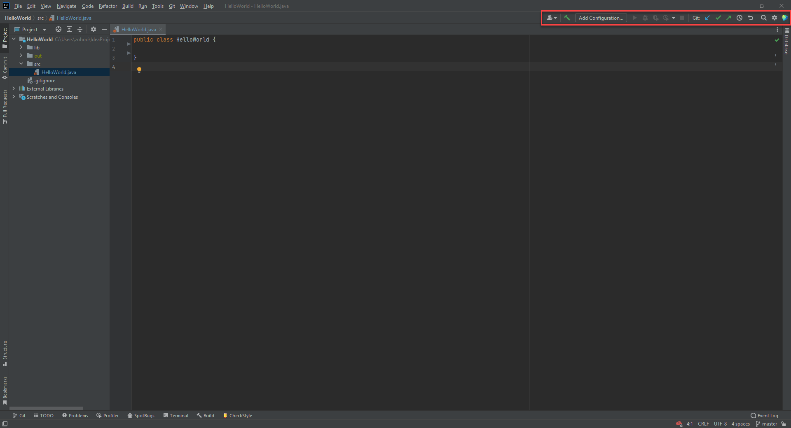
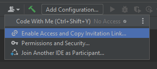
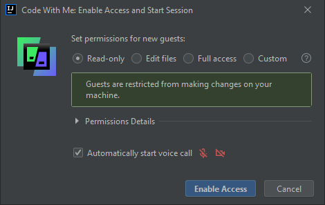
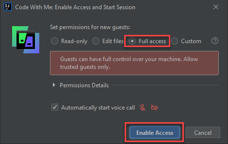
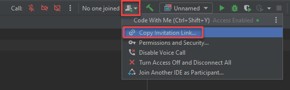
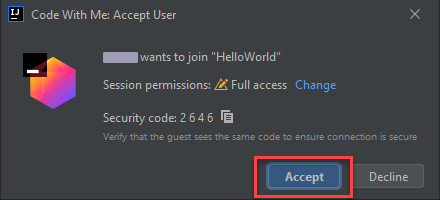
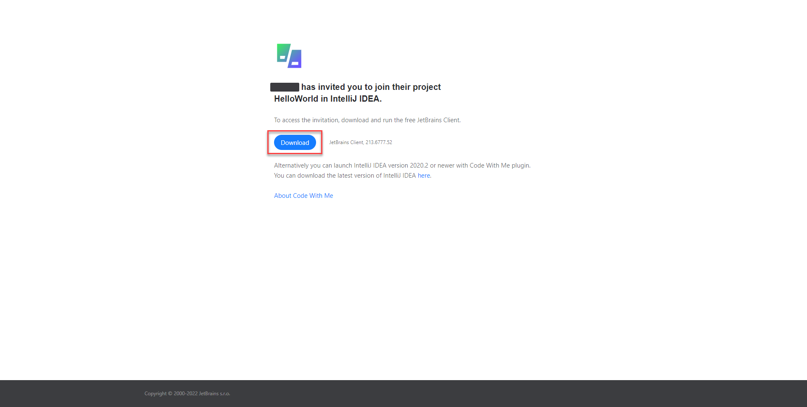
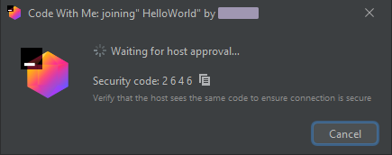

# Code With Me 

---

## Overview

   Code With Me is a feature in IntelliJ and other JetBrains IDEs that enables developers to collaborate on a project. This is achieved by giving one or more developers access to the development environment that a host developer is working on. The participants can view, edit and run code based on the level of access that the host has given them. The Code With Me feature enables developers to pair-program or review each other's code with ease.
   
---

## Setting Up the Code With Me Environment 
   One person who has the IntelliJ IDE installed and running on their device needs to become the host to enable this feature. The host computer is the device that holds the project files and is used to execute the project.
   
---

## Hosting a Code With Me Session

   You first need to open a project or create a new one to host a session. Check out this [link](https://daquioag.github.io/team-SAL/docs/configuration/) for instructions.

   Once you have your IDE open, locate the top-right toolbar

   

1. From the toolbar, open the Code With Me dropdown menu by clicking on the icon of two people.
   
   
   
2. Once the dropdown menu appears, choose **Enable Access and Copy Invitation Link…** 
   
   
   
   This will open a new window named **Code With Me: Enable Access and Start Session**, which lets you set permissions for participants that join your code with me session as a guest:
   
   
   
3. To have guests be able to write and execute code while working with you, choose the **Full access** option and click **Enable Access**
   
   
   
   <code>⚠️ WARNING</code>: By giving guests full access, they can edit files, run code, and access the command line on your computer. Do not give this permission to guests you do not fully trust. You can give guests Read-only permissions if you want them to look at code that resides on your device, or you can customize their level of   access by expanding the Permission Details menu.
   
   After you click Enable Access, IntelliJ automatically copies an invite link that you can send to other developers so they can join your session. If you lose this link, you can obtain it again by clicking the Code With Me icon on the top-left toolbar and selecting **Copy Invitation Link…** from the dropdown menu.
   
   
   
4. Now you need to send the invitation link to another participant. Do this by pasting the link in a communication channel such as a chatroom or email.
   
   Once a participant opens the invitation link on their end, a new window called **Code With Me: Accept User** will open on the host's computer. The host is then prompted to let the guest join the project.
   
   <code>⚠️ ATTENTION</code>: As a host, you can ensure that the right person is joining your project by checking their user name and cross-checking their security code.
   
5. To give a guest access to the project, click the Accept button in this window.
   
   
   
   You will then see a notification on the bottom-right of your IDE, informing you that another user has joined.
   
   
   
---
   
## Joining a Code With Me Session as a Guest
   
1. Upon receiving the Code With Me invitation link from a host, input it into a web browser by pasting it into the address bar and pressing Enter.
   
2. The Code With Me invitation web page will open next. On this page, click on the download button to download the Code With Me Client Launcher.
   
   
   
3. After downloading the Code With Me client launcher, open the file and wait for the installation to complete. 
   
   Afterwards, you should be prompted with a window with the message **"Waiting for host approval.."**. You can provide the host with the security code displayed on this page if needed. 
   
   
   
   Once the host has approved you to join their project, a new window will open on your device with the project, and you are ready to collaborate!
   
---
   
## Conclusion

Now that you have mastered how to use IntelliJ's Code With Me, collaborating with team members to work on projects together will be streamlined. Use Code With Me to debug, perform pair programming, or simply show off your code! We encourage you to use Code With Me to become better programmers together!
